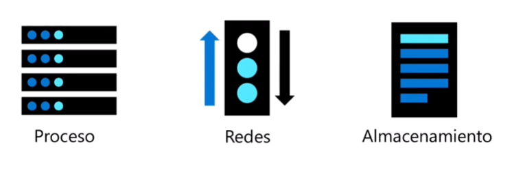
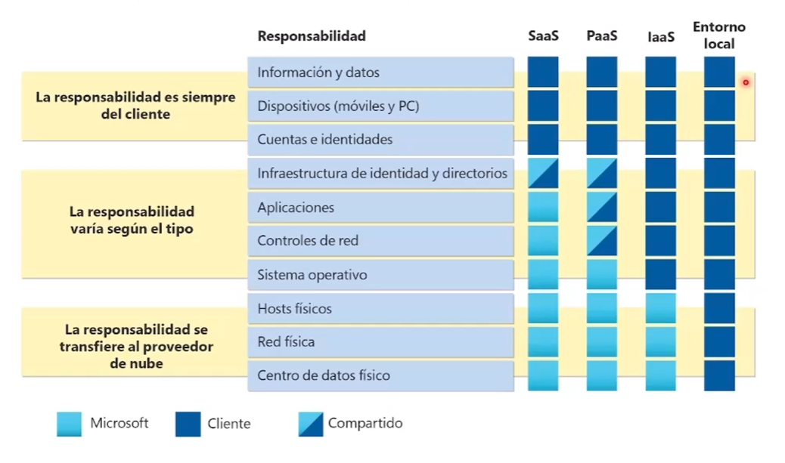
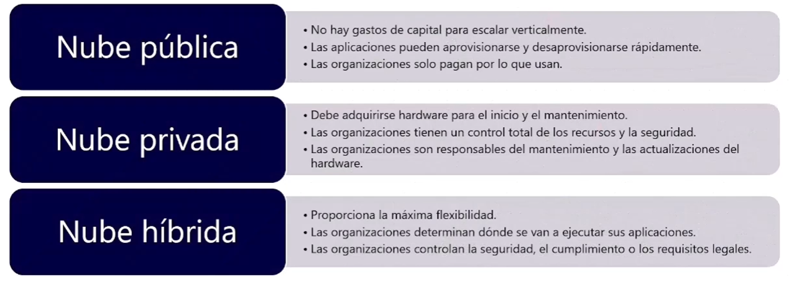

Informática en la nube
==  
\
**¿Qué es la informática en la nube?**  
La informática en la nube es la presentación de ``servicios informáticos a través de internet``, lo que permite una innovación más rápida, recursos flexibles y precios regulables.  

\
**Modelo de responsabilidad**  
- Responsabilidad del cliente: ``SaaS``
    - Información y datos.
    - Dispositivos
    - Cuentas e identidades

- Responsabilidad variables: ``PaaS``
    - Infraestructura de identidad y directorios
    - Aplicaciones
    - Controles de red
    - Sistema operativo

- Responsabilidad del proveedor: ``IaaS``
    - Hosts físicos
    - Red física
    - Centro de datos físico  

\
**Modelos de nube**
- Nube privada: 
    - Las organizaciones crean un entorno en la nube ``en su centro de datos``.
    - La organización es ``responsable de operar los servicios que ofrece``.
    - ``No proporciona acceso a usuarios ajenos`` a la organización. 

- Nube pública:
    - ``Propiedad de Cloud Services o proveedor de hosting``.
    - ``Proporciona recursos y servicios`` a múltiples organizaciones y usuarios.
    - Se ``accede a través de una conexión a red segura`` (generalmente a través de Internet).

- Nube Híbrida:
    - Combina ``nubes públicas y privadas`` para permitir que ``las aplicaciones se ejecuten en la ubicacion más adecuada``.

- Resumen comparativo

  

\
**Comparación de CapEx y OpEx**
- Gastos de Capital (CapEx)
    - El ``gasto inical de dinero en infraestructura física``.
    - Los costes derivados de CaEpx ``tienen un valor que reduce en el tiempo``.
- Gastor Operativos (OpEx)
    - Gasto en productos y servicios necesarios, ``pago por uso``.
    - Obtenga una ``factura de inmediato``.  

\
**Modelo basado en el consumo**  

Los proveedores de servicios en la nube operan en un modelo basado en el consumo, lo que significa que los usuarios finales solo pagan por los recursos que usan. ``Lo que usan en lo que pagan``.  
- Mejor predicción de costes.
- Se proporcionan precios para recursos y servicios individuales.
- La facturación se basa en el uso real.