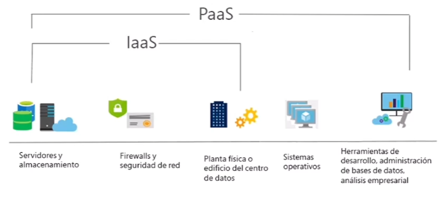
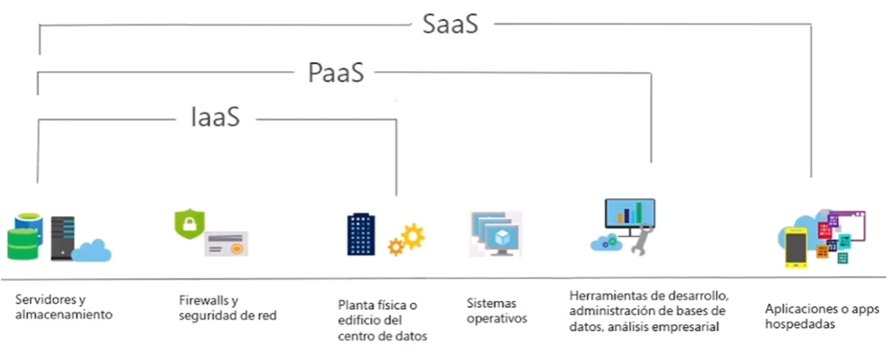

Tipos de servicios en la nube
==  
- Infraestructura como servicio - IaaS
- Plataforma como servicio - PaaS
- Software como servicio - SaaS

\
**Infraestructura como servicio - IaaS**  
Cree una insfraestructura de TI de ``pago por uso alquilando servidores, máquinas virtuales, almacenamiento, redes y sistemas operativos`` de un proveedor de nube.  

  

\
**Plataforma como servicio - PaaS**  
Proporciona un ``entorno para compilar, probar e implementar aplicaciones de software, sin crentrarse en la administración de la infraestructura subyacente``.  

  

\
**Software como servicio - SaaS**  
Los usuarios usan ``aplicaciones basadas en la nube y se conectan a ellas a través de internet``. Algunos ejemplos de estas aplicacionmes son ``Microsoft Office 365, el correo electrónico y los calendarios``.  

  

\
**Comparativa de servicios en la nube**  
|IaaS|PaaS|SaaS|
|-|-|-|
|El servicio en la nube ``más flexible``. |Enfoque en el ``desarrollo de aplicaciones``. |Modelo de precio de ``pago por uso``.| 
|``Usted configura y administra el hardware`` de la aplicación.|``El proveedor de nube controla la administración`` de la plataforma.|Los ``usuarios pagan por el software que utilizan`` en un modelo de suscripción.|
