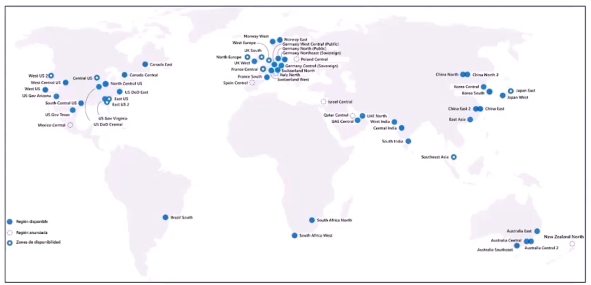
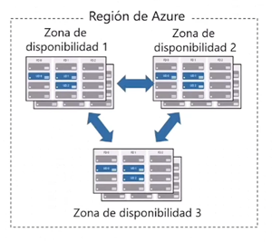
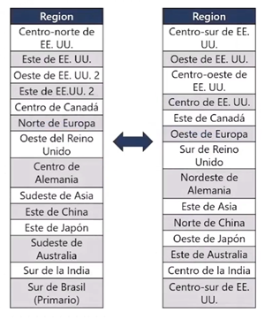
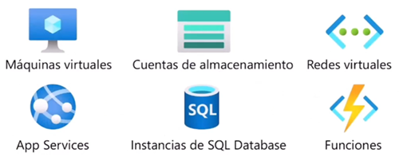
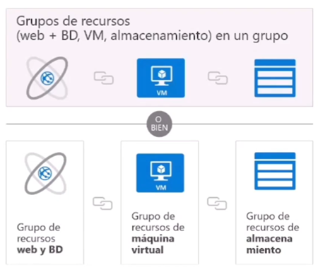
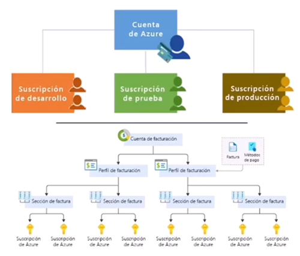
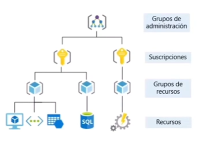

Componentes de la arquitectura de Azure
==  
\
**Objetivos:**  
- Describir las ``regiones de Azure, los pares de regiones y las regiones soberanas``.
- Describir las ``zonas de disponibilidad``.
- Describir los ``centros de datos de Azure``.
- Describir los ``recursos y grupos de recursos de Azure``.
- Describir las ``suscripciones``.
- Describir los ``grupos de administración``.
- Describir la ``jerarquía de grupos de recursos, suscripciones y grupos de administración``.  

\
**Regiones**  
- Las regiones ``se componen de uno o mas centro de datos próximos``.
- Proporciona ``flexibilidad y capacidad de adaptación`` para ``reducir la latencia`` de los clientes.
- Conserva la ``residencia de datos`` con una oferta de cumplimiento integral.  
\
  

\
**Zonas de disponibilidad**
- Proporciona ``protección contra el tiempo de inactividad debido a errores del centro de datos``.
- ``Centros de datos separados fisicamente dentro una misma región``.
- Cada centro de datos está ``equipado con redes, alimentación y refrigeración independientes``.  
\
  

\
**Pares de regiones**  
- Al menos ``500km de separación entre pares de regiones``.
- ``Replicación automática`` para ``algunos servicios``.
- ``Recuperación`` de una región clasificada ``por orden de prioridad`` en caso de interrupción.
- Las ``actualizaciones se implementan secuencialmente para minimizar el tiempo de inactividad``.  
\
  

\
**Regiones soberanas de Azure**  
*(servicios de la administración pública de Estados Unidos)*  

``Cumplen las necesidades de seguridad y cumplimiento de las agencias federales de EE.UU, los gobiernos estatales y locales``, y sus proveedores de soluciones.
- Azure Government:
    - ``Instancia seprada de Azure``.
    - Fisicamente aislado de los despliegues del gobierno no estadounidense.
    - Accesible solo para el personal autorizado y seleccionado.

\
**Regiones soberanas de Azure**  
*(Azure China)*  

- Instancia ``físicamente separada de Azure Cloud Services`` y ``administrada por 21Vianet``.
- Todos ``los datos se quedan dentro China`` para asegurar el cumplimiento.

\
**Recursos de Azure**  
Los recursos de Azure son ``componenetes como almacenamiento, máquinas virtuales y redes que están disponibles para crear soluciones en nube``.  
\
  

\
**Grupos de recursos**  
Un grupo de recursos es un ``contenedor para admnistrar y agregar recursos en una sola unidad``.
- Los recursos ``solo pueden estar presentes en un único grupo``.
- Los recursos ``pueden estar en diferentes regiones``.
- Los recursos ``se pueden trasladar a otros grupos de recursos``.
- Las ``aplicaciones pueden utlizar varios grupos de recursos``.  
\
  

\
**Suscripciones de Azure**  
Una suscripción de Azure ``proporciona acceso autenticado y autorizado`` a las cuentas de Azure.
- **Límite de facturación:** ``Genere informes de facturación independientes`` para cada suscripción.
- **Límite de control de acceso:** ``Administre y controle el acceso a los recursos`` que los usuarios pueden aprovisionar con suscripciones específicas.  
\
  

\
**Grupos de Administración**
- Los ``grupos de administración pueden incluir viarias suscripciones`` de Azure.
- Las ``suscripciones heredan las condiciones aplicadas al grupo de administración``.
- Se admiten ``10000 grupos de administración en un único directorio``.
- Un árbol de grupo de administración ``puede admitir hasta 6 niveles de profundidad``.  
\
  

