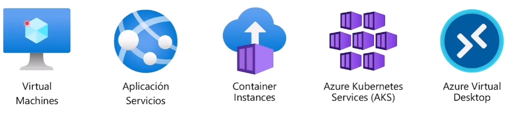
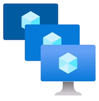
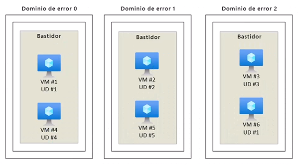
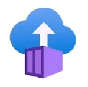
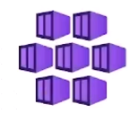
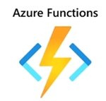
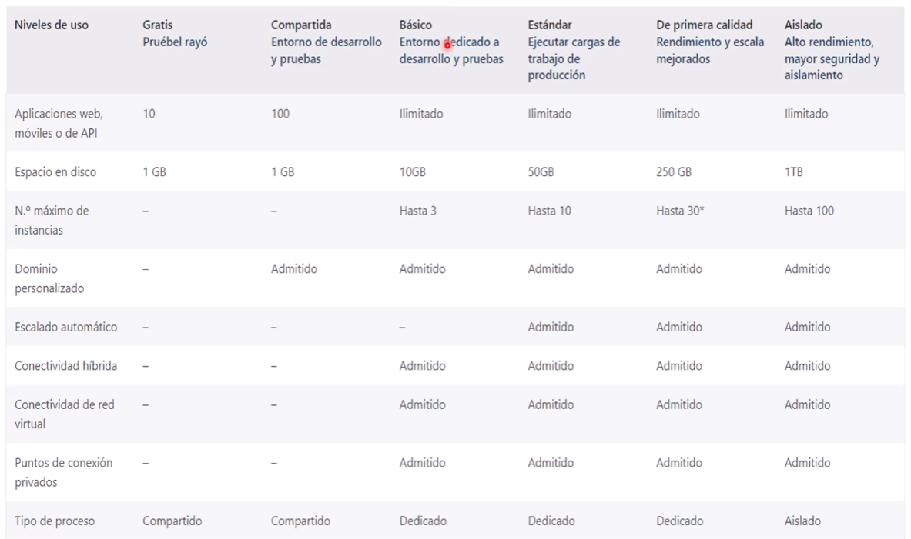
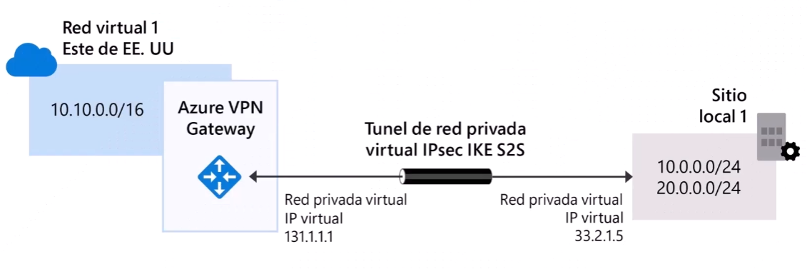
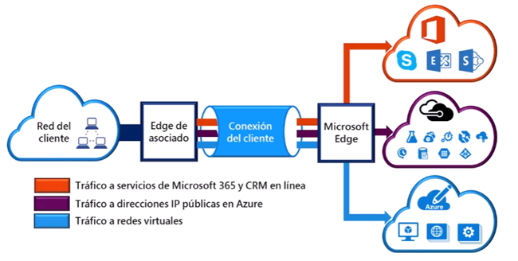

Procesos y redes
==  
\
**Objetivos**  
- ``Comparar`` los ``tipos de procesos``, incluidas las instancias de ``contenedor``, las ``máquinas virtuales y la funciones``.
- ``Describir`` las ``opciones de máquina virtual``, incluidas las máquinas virtuales(VM), los ``conjuntos de escalado de máquinas virtuales``, los ``conjuntos de disponibilidad`` de máquinas virtuales y ``Azure Virtual Desktop``.
- Describir los recursos necesarios para las máquinas virtuales.
- Describir las ``opciones de hospedaje de aplicaciones``, incluidos ``Azure Web Apps``, ``contenedores`` y ``máquinas virtuales``.
- Describir las ``redes virtuales``, incluido el propósito de ``Azure Virtual Networks``, las ``subredes virtuales de Azure``, el ``emparejamiento``, ``Azure DNS``, ``VPN Gateway`` y ``ExpressRoute``.
- Definir ``puntos de conexión públicos y privados``.  

\
**Servicios informáticos de Azure**  
Azure ``compute`` es un servicio de informática a petición que porporciona recursos informáticos como discos, procesadores, memoria, redes y sistemas operativos.
- Virtual Machines - IaaS
- App Services - PaaS
- Containers - PaaS
- Azure Kubernetes Services (AKS)
- Azure Virtual Desktop  
\
  

\
**Azure Virtual Machines**  
Son Emuladores de software de equipos físicos.
- Incluye un procesador virtual, memoria, almacenamiento y redes.
- Identificada como ``IaaS``  

\
**VM Scale Sets - Conjuntos de escalado**  
Los conjuntos de escalado ``proporcionan una oportunidad de carga equilibrada para escalar automaticamente los recursos``.  
- Escale ``hacia afuera`` cuando aumenten las necesidades de los recursos.
- Escale ``hacia adentro`` cuando las necesidades de los recursos sean menores.  
\
  

\
**Conjuntos de disponibilidad de máquina virtual**  
Estas configuraciones no suponen un costo adicional.
Herramienta que ``ayuda a crear entornos resistentes y alta disponibilidad``, están diseñados para ``garantizar que nuestras (VM) escalen las actualizaciones y tengan una contectividad de red y potencia variada``, esto ``evita que se pierdan las (VM) ya sea por fallas de energia o de red``. Los conjuntos de dispobilidad ``logran esta configuración mediante la agrupación de las (VM)`` de formas puntualmente:
- **Dominio de actualización:** Es la ``forma de agrupar`` las (VM) para que se puedan reiniciar al mismo tiempo, permite ``aplicar actualizaciones mientras que solo una agrupación de dominio está sin conexión a la vez``.
- **Dominio de error:** ``Agrupa las (VM) por fuente de alimentación y conmutador de red comun de manera predetermindad``, el conjunto de disponibilidad ``divide las (VM) en un máximo de 3 dominios de error``, ayuda a la protección ante errores de fuente de alimentación o red.  
\
  

\
**Azure Virtual Desktop**  
Es la ``virtualización de aplicaciones y escritorios escalables`` que se ejecuta en la nube.  
- Modelo de pago por uso.
- Cree un entorno de ``virtualización de escritorio`` completo ``sin tener que ejecutar servidores`` de puerta de enlace adicionales.
- Reduzca el riesgo de que los recursos se queden atras.
- Implementación de ``varias sesiones verdaderas``.  
\
  

\
**Azure Container Services**  
Los contenedores de Azure son un ``entorno virtualizado ligero`` que ``no requiere administración del sistema operativo`` y ``puede responder a los cambios bajo demanda``.  
- **Azure Container Instances:** Una Oferta de ``PaaS`` que ejecuta un contenedor de Azure ``sin la necesidad de administrar una máquina virtual o servicios adicionales``.

    

  

- **Azure Kubernetes Service:** Un ``servicios de organización`` completo para ``contenedores con arquitecturas destribuidas y grande volúmenes de contenedores``.

    

  

\
**Azure Funcitions** - *serverless*  
Código ``basado en eventos`` que ``ejecuta su servicio y no la infraestructura subyacente``. Solo se ``paga por el tiempo de ejecución y los recursos``, es compatible con diferentes lenguajes de programación.  
\

\
**Comparación de opciones de proceso de Azure**  

|Máquinas Virtuales|Escritorio Virtual|Contenedores|
|-|-|-|
|Servidor basado en la nube que adminite entornos Windows o Linux|Proporciona una experiencia de escritorio de Windows para equipo personal basada en la nube|Entorno ligero y en miniatura adecuado para ejecutar microservicios|
|Útiles para las migraciones mediante lift-and-shift a la nube|Aplicaciones dedicadas para conectarse y usar, o accesibles desde cualquier explorador moderno|Diseño para escalabilidad y resistencia a través de la orquestación|
|Paquete completo del sistema operativo, incluido el sistema operativo host|El inicio de sesión de varios clientes permite a varios usuarios iniciar sesión en la misma máquina al mismo tiempo|Las aplicaciones y los servicios se empaquetan en un contenedor que se encuentra sobre el sistemas operativo host. Varios contenedores pueden sentarse en un sistema operativo host|  

\
**Azure App Services** - PaaS  
Es una ``plataforma totalmente administrada`` para ``crear, implementar y escalar aplicaciones web y API repidamente``.  
- Funciona con ``.NET, .NET Core, Node.js, Java, Python o php``.
- Oferta de ``PaaS`` con requisitos de cumplimiento, seguridad y rendimiento de nivel empresarial.  
\
  

\
**Planes de Azure App Services**  
\
  

\
Servicios de redes de Azure  
==  
\
**Azure virtual Network (VNet)**  
Permite que los ``recursos de Azure se comuniquen entre si``, con ``Internet y con redes locales``.
- Puntos de ``conexión públicos``, accesibles desde cualquier lugar de Internet.
- Puntos de ``conexión privados``, accesibles solo desde dentro de la red.
- ``Subredes virtuales``, para segmentar la red y satisfacer sus necesidades.
- ``Emparejamiento de redes``, para la ``conexión directa de redes privada``.  
\
  

\
**Virtual Private Network GateWay** - (VPN)  
Se usa para ``enviar tráfico cifrado`` entre una red virtual de Azure y una ubicación local a través de internet público.  
\
  

\
**Azure Express Route**  
``Extiende las redes locales de Azure`` a trevés de una ``conexión privada que facilita un proveedor`` de conexión.  
\
  

\
**Azure DNS**  
- Hospedaje de dominios que ofrece resolución de nombres mediante la infraestructura de Azure.
- ``Confiabilidad y rendimiento`` aprovechando una ``red global de servidores de nombres de dominio`` mediante ``redes de Anycast``.
- ``La segurtidad de Azure DNS se basa en Azure resource manager``, lo que permite el ``control de acceso basado en rol y la supervisión`` y el registro.
- ``Facilidad de uso`` para ``administrar los recursos externos`` y de ``Azure`` con un ``único servicio DNS``.
- Las ``redes virtuales personalizadas`` le permiten usar nombres de dominio privados y totalmente personalizados en las redes virtuales privadas.
- Los registros de alias ``admiten conjuntos de registros de alias`` para que apunten directamente a un recurso de Azure.  

