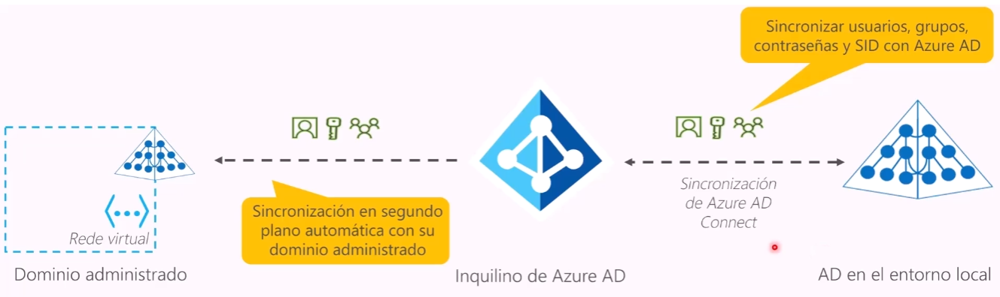
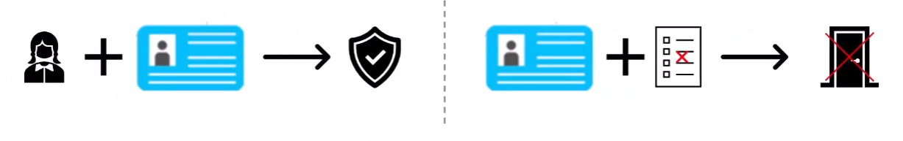
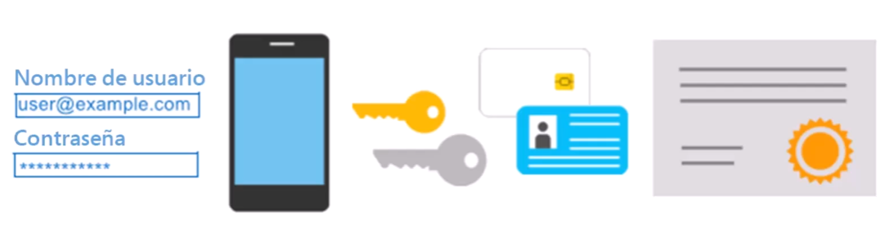
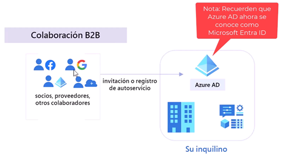
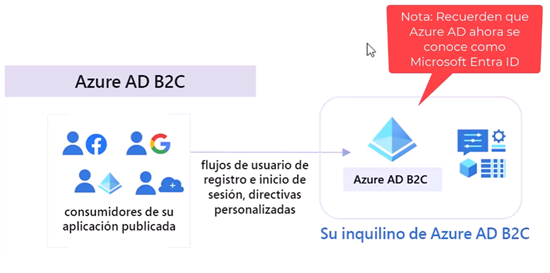
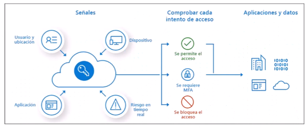
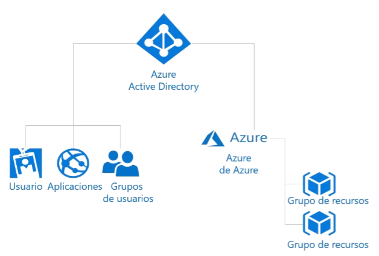
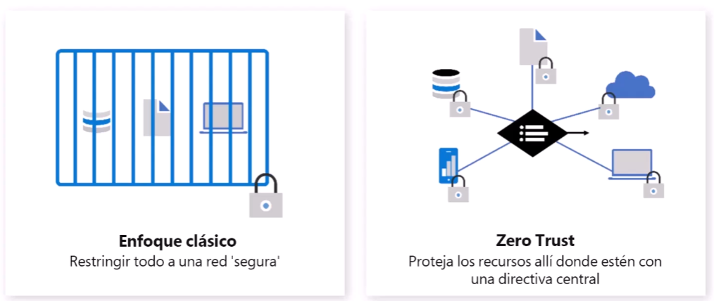
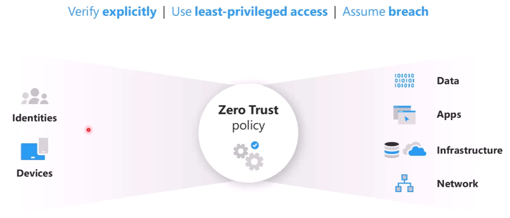
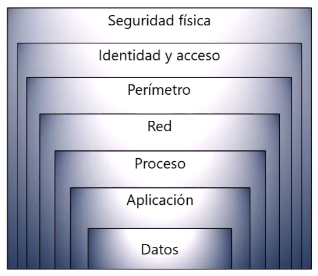

Identidad, acceso y seguridad
==  

**Objetivos**  
- Descripción de los ``serivcios de directorio de Azure``, incluido ``Azure Active Directory(AD)``
y ``Azure AD DS``, parte de Microsoft Entre.
- Descripción de los ``métodos de autenticación de Azure``, incluido el ``inicio de sesión único (SSO)``, la ``autenticación multifactor(MFA)`` y sin contraseña.
- Descripción de ``identidades externas`` y acceso de ``invitado en Azure``.
- Descripción del ``acceso condicional`` de Azure AD.
- Descripción del ``control de acceso basado en roles (RBAC)`` de Azure.
- Descripción del concepto de ``Confianza cero``.
- Descripción del ``propósito del modelo de defensa`` en profundidad.
- Descripción del propósito de ``Microsoft Defender for Cloud``.  

\
**Microsoft Entra ID** - *(Antes conocido como Azure Active Directory)*  
Es el serivicio de ``administración de identidad y acceso`` basado en la nube de Microsoft Azure.
- Podemos ``ingresar`` al diferentes servicios con ``las mismas credenciales``.
- Autenticación (Los empleado inician sesión para acceder a los recursos).
- Inicio de sesión único (SSO).
- Administración de aplicaciones.
- Negocio a negocio (B2B).
    - Para empresas que vayan a colaborar.
    - Invitaciones segurar con las credenciales de su empresa.
- Servicios de identidad de negocio a cliente (B2C).
    - Acceso para clientes que harán uso de los servicios.
- Administración de dispositivos.
    - Politicas de seguridad
    - Doble autenticación - Multifactor authenticator

\
**Microsoft Entra Domain Services** - *(Antes Azure AD DS)*  

  
- Servicio PaaS de controlador de dominio.
- Todas las ``ventajas de los servidores de dominio`` basados en la nube ``sin administrar controladores`` de dominio.
- Ejecución de ``aplicaciones heredadas`` (que no pueden usar estándares de autenticación modernos).
- ``Sincroniza automática``.  

\
**Diferencias entre autenticación y autorización**  
|Autenticación(AuthN)|Autorización(AuthZ)|
|-|-|
|Identifica a la persona o el servicio que intenta acceder al recurso.|Detener el nivel de acceso de una persona o servicio autenticados.|
|Solicita credenciales de acceso legítimas.|Define a que datos puede acceder y qué puede hacer con ellos.|
|Bases para crear principios seguros de identidad y control de acceso.||  

    

\
**Autenticación multifactor de Microsoft Entra (MFA)**  
Proporciona seguridad adicional para sus identidades al requerir 2 o más elementos para la autenticación completa
- Algo que sabes <-> Algo que posee <-> Algo que usted es  

\
  

\
**Identidades externas B2B**  

    

\
**Identidades externas B2C**  

    

\
**Acceso condicional**  
Es lo que usa Azure Active Directory ``(Microsoft Entra ID)`` para reunir señales, tomar decisiones y aplicar las directivas de la organización. Esta característica sobre se encuentra ``disponible en la versión premium``.  
- Usuario o pertenecia a grupo
- Ubicacion de la IP
- Dispositivo
- Aplicación
- Detección de riesgos  

    

  

\
**Control de acceso basado en roles de Azure (RBAC de Azure)**  
- Creación de ``roles personalizados`` o uso de ``roles predefinidos``.
- ``Administración`` de ``acceso específico``.
- ``Separe las tareas dentro del equipo`` y conceda a los usuarios solo el acceso que necesitan para realizar sus trabajos.
- Permite el ``acceso a Azure Portal`` y controlar el ``acceso a los recursos``.  
- Log de actividades y/o cambios.

    

  

\
**Confianza cero** - *Zero Trust*  

    

  

\
**Securing your organization with Zero Trust**  

    

  

\
**Defensa en profundidad**  
- ``Realentiza el avance de un ataque dirigido a adquirir el acceso no autorizado de los datos``.
- Un enfoque por capas para asegurar los sistemas informáticos.
- Proporciona múltiples niveles de protección.
- Los ataques contra un capa está aislados de las capas subsiguientes.  

    

  

- Seguridad física: 
    - Protección de los equipos y hardware en el centro de datos.
- Identidad y acceso:
    - Control de acceso a la infraestructura y control de cambios.
- Perímetro:
    - Protección contra DDoS.
- Red: 
    - Limitación de comunición entro los recursos, por controles de acceso y segmentación.
- Proceso: 
    - Protección al acceso a las MV.
- Aplicación: 
    - Protección de aplicaciones, libre de vulnerabilidades.
- Datos: 
    - Control de acceso a los datos empresariales y de clientes.