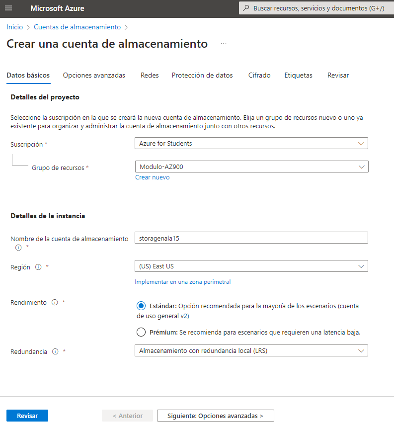
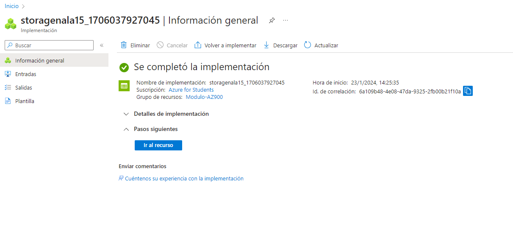
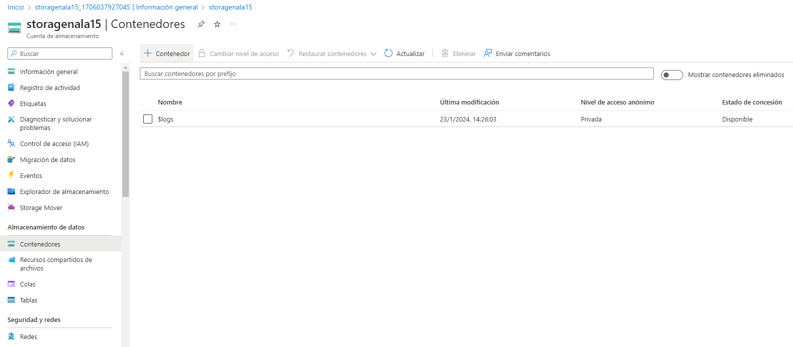
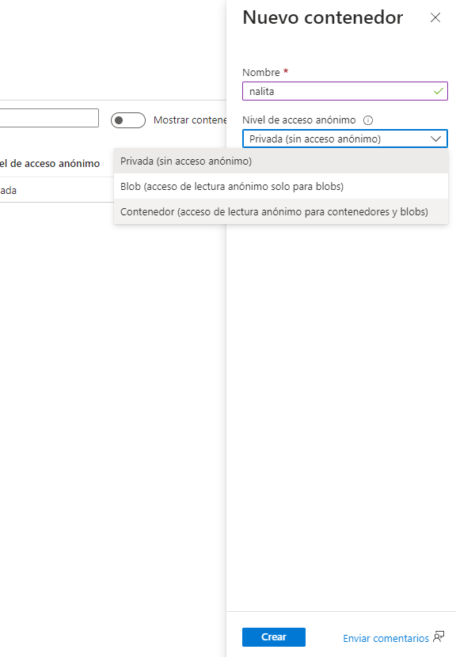
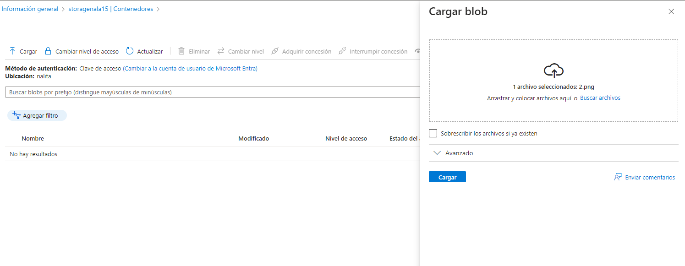
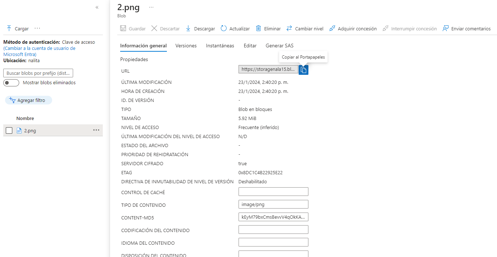

Cuentas de almacenamiento
==  

1. Datos básicos  
  

\
2. Nos dirigimos al recurso  
  

\
3. Nos dirigimos a contenedores y generamos uno nuevo
  

\
4. Nombre y tipo de acceso  

\
5. Cargamos el archivo.  
  

\
6. Accedemos al archivo y ya podremos obtener el link de lectura.
